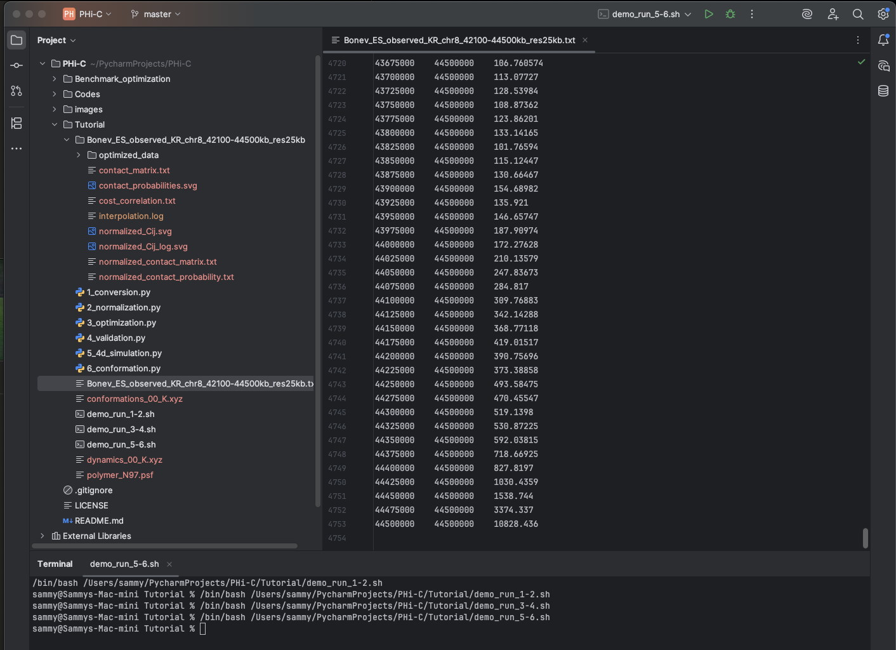
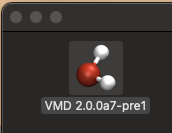
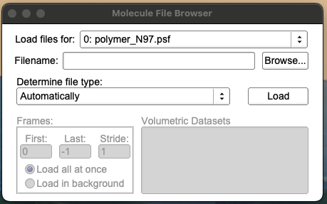
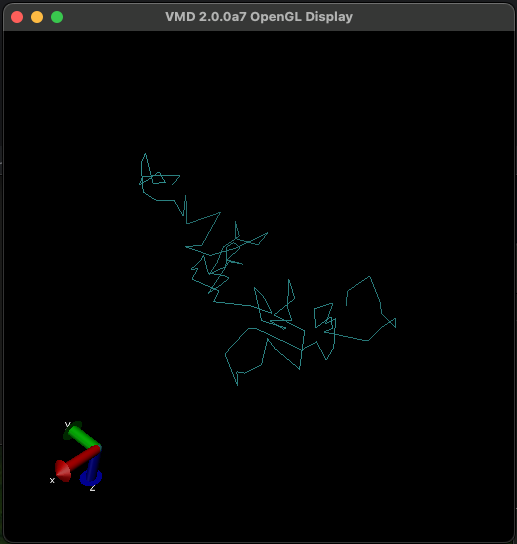
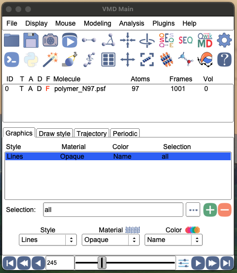

# Experiment with two Python programs, PHi-C and PHi-C2

This section is my record for experimenting with  
previous version of PHi-C and
newer version which is PHi-C2.  
(During mid August 2025)

---

# PHi-C

## Environment

Mac OS mini M4  

JetBrains IDE PyCharm

## Source Code
GitHub [PHi-C Public Repository](https://github.com/soyashinkai)

## Screenshot

Running locally after all tutorial scripts 1 to 6 were run.  
Sample data is showing cordinates with each frequency.

To show visualized result,  
Visual Molecular Dynamics (VMD) is required.

Registration is required but it is available for free.  
[Official Site](https://www.ks.uiuc.edu/Research/vmd/)

This shows an icon for latest Alpha 2.0 version under Mac OS x.

In VMD application, load 2 files.  
- First [.psf] the stracutre file,  
- then [.xyz] the animation file.

Render result will be shown.  
Sample is 'mouse embryonic stem cell data'  
'chromosome 8'

It can be move around and latate in 3 dimentions  
by using a mouse movement.

Also it will show animated result in this same window.

This is VMD Main window.  
On the bottom, there are slider and  
animation controls are shown.

# PHi-C2

> [!IMPORTANT]
> This section is also <ins> under development<ins>.  
> Thank you,
